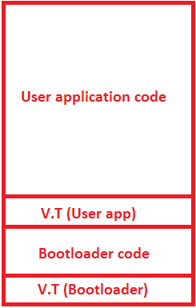
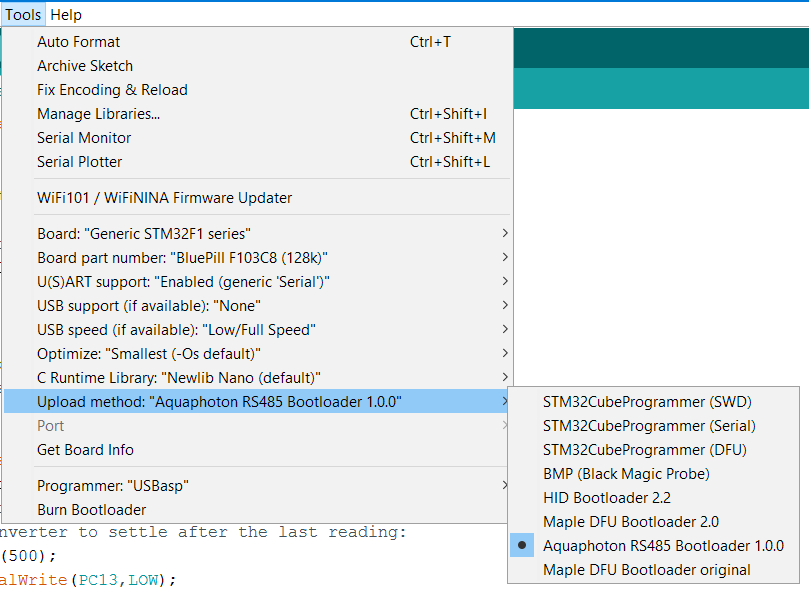

# Aquaphoton RS-485 Bootloader

## Introduction

This is a simple bootloader for the microcontroller STM32F103CB. It is *currently* able to erase sectors in the flash memory ,write a new binary file into flash memory and get some info about the MCU itself while using the RS485 protocol to communicate.
This bootloader is an application of the online course [STM32Fx Microcontroller Custom Bootloader Development](https://www.udemy.com/course/stm32f4-arm-cortex-mx-custom-bootloader-development/) on udemy.

---

## How the bootloader works

The Flash memory is divided into pages each is 1 KB and total of 128 KB (For CB version).
The first sector contains the Main Stack pointer **MSP** , Reset handler and the rest of the Vector Table then the rest of the application follows.

By using CubeMX -which is the **HAL** provided by **ST Microelectonics**- we can read, erase and write a sector or more in run time and without special debugging interfaces.

Therefore, the flash memory is split into 2 parts:  

* The bootloader code :  for dealing with flash memory,communicating with a host application for flashing new application and running the user application

* The user application and it can't communicate with the host application or modifying itself.

Since the bootloade is still an application so it needs its **MSP** , **Reset Handler**, **Vector Table** and its own peripheral initializations and etc. ,so the flash can be cosidered as follwing:

* The **Vector table** of the bootloader located at the starting address of the flash memory which is **0x0800 0000**.

* The rest of the Bootloader code which takes nearly 16 KB of memory (This needs more optimization).

* The **Vector table** of the user application located after the  bootloader code at the 16th sector at the address **0x0800 4000**.

* The rest of the user application code.



Since the user application has its **Vector table** at a diffrenet location from the default one , so both the linker and the microcontroller has to deal with the new location.

The bootloader can be accessed by pressing a button right after resetting the microcontroller or it will jump to the userr application directly

---

## How to use this bootloader

### Uploading the bootloader

The first step to use this bootloader is to upload it to the microcontroller.
This  can be done by using the compiled **Bootloader_f103cB.bin** in the *debug* folder and uploading it using **ST-link** debugger by using [STM32 ST-link utility](https://www.st.com/en/development-tools/stsw-link004.html) or [STM32CubeProgrammer](https://www.st.com/en/development-tools/stm32cubeprog.html)
at the starting location of the flash memory **0x0800 0000**

### Configuring user application in stm32IDE

*This section is explained thoroughly in section 12 in the mentioned course.*

There are two modifications need to be done to the user application to change the starting address:

First: Modifying the linker script which is found in the main directory of the project with the name *STM32F103CBTX_FLASH.ld* . At the  beginning the following code is found :

```c
MEMORY
{
  RAM    (xrw)    : ORIGIN = 0x20000000,   LENGTH = 20K
  FLASH    (rx)    : ORIGIN = 0x08000000,   LENGTH = 128K
}
```

Change the address of the flash to **0x08004000**

```c
MEMORY
{
  RAM    (xrw)    : ORIGIN = 0x20000000,   LENGTH = 20K
  FLASH    (rx)    : ORIGIN = 0x08004000,   LENGTH = 128K
}
```

Second : Modify the vector table offset register **VTOR** by using the macro **VECT_TAB_OFFSET** in the file *system_stm32f1xx.c* found in the directory *Core/Src/*

this register is found in the **NVIC** unit in the **cortex m3** core.

```c
#define VECT_TAB_OFFSET  0x0000U /*!< Vector Table base offset field.This value must be a multiple of 0x200. */
```

to the desigred offset **0x4000**

```c
#define VECT_TAB_OFFSET  0x4000U /*!< Vector Table base offset field.This value must be a multiple of 0x200. */
```

Then it is necessary to Clean the project before building it after these changes.

---

### Configuring user application in Arduino IDE

Arduino IDE uses a specific system to list different boards and its different variants and all of the settings of the board which is chosen in the tools menu. This is based on the boards installed by the boards manager.

For this bootloader the STM32 Arduino core version 1.8.0 is used.


for more information and how to install it check [Arduino core STM32](https://github.com/stm32duino/Arduino_Core_STM32).

this core has many options for uploading by using **St-link** debugger or other bootloaders ,but another custom option will be added.



the directory of the all arduino boards files is founf in the *Localappdata* folder in the windows drive.

the needed directory is *%localappdata%/Arduino15/packages/STM32/hardware/stm32/1.8.0/* (type it in the address bar)

Modify the file *boards.txt* at the line number 883 (under the Upload menu section in Generic F1 section) by adding the following lines

```
GenF1.menu.upload_method.RS485Method=Aquaphoton RS485 Bootloader 1.0.0
GenF1.menu.upload_method.RS485Method.upload.protocol=RS485
GenF1.menu.upload_method.RS485Method.upload.tool=RS485
GenF1.menu.upload_method.RS485Method.build.flash_offset=0x4000
GenF1.menu.upload_method.RS485Method.build.bootloader_flags=-DBL_HID -DVECT_TAB_OFFSET={build.flash_offset}
```
where the flash offset is the same as mentioned before **0x4000**

then in the Arduino IDE choose the options as presented.

Getting the binary file after compilation in Arduino IDE is a rather tedious ,all of the compiled files are saved in a temporary folder in the *%temp%* system folder as *Arduino_build_XXXXX*
the specific path can be found in log of the build process

---

## The host python script

*This script is a modification the the one presented in the course and needs to optimized or rewritten.*

This script is currently able to get some information (supported commands , chip ID , bootloader version) , erase specific flash pages , flashing a binary file to the flash memory and jumping to a specific address in the flash memory.

The script communicate with the bootloader via RS485 protocol so first thing is to determine the COM port of the used converter and then choosing the command to excute.

Commands system is descriped in section 9 in the course.

It is written in python 3 and uses pyserial module.

**NOTE :** the microcontroller must be in micro controller mode to communicate with the host script. This is done by pressing the button while resetting (connections will be discussed later). The boot pins must be 0 to ensure the booting is from flash memory.

### Erasing flash memory pages

This command erases a specific number of flash memory pages starting from page 16 at the address **0x0800 4000**. The first 16 pages (0 to 15) contain the bootloader code and then they cannot be erased withou using a debugger.

### Flashing a binary file

This command requires a binary file to be in the same directory of the script and with the name *user_app.bin*

The command requires the starting address of the page that the file will be flashed to, it is the address **0x0800 4000**.

This parameter is for debugging and will be modified later.

After flashing, the microcontroller must be reset to excute the new user application.

**IMPORTANT NOTE :** To ensure that a new user application is executed correctly, the old user application must be completely erased.

### Jumping to a specific address

This command was used for debugging and to jump to the reset handler of the user app.

---

## Hardware and pin connection

The [**Blue Pill**](https://stm32-base.org/boards/STM32F103C8T6-Blue-Pill.html) board was used in the testing of this bootloader.


[Maxim MAX485](https://www.maximintegrated.com/en/products/interface/transceivers/MAX485.html) ic was used as RS485 transceiver.[Datasheet](https://datasheets.maximintegrated.com/en/ds/MAX1487-MAX491.pdf)

[Logic converter module](https://media2.arduiner.com/3552-big_default_2x/logic-level-converter-33v-5v-ttl.jpg) module was used to convert the MAX485 5V range to the STM32F103 3.3V range.

[USB to RS485 converter](https://img.bgxcdn.com/thumb/large/oaupload/banggood/images/2C/47/951273a6-f31d-4fba-b7d7-4e2bcc86c7e0.JPG) was used to connect to the host script.

[USB to Serial converter](https://makerselectronics.com/product/cp2102-chip-usb-to-ttl-serial-converter) is used only for debugging and showing the current state of the bootloader and can be ignored in the final version.

| Pin number            | Describtion                                   |
| --------              | --------------                                |
| UART2 (PA2 ,PA3)      | Debug serial port                             |
| UART2 (PB10 ,PB11)    | Communication serial port (to logic onverter) |
| PA15                  | MAX485 DE and RE pins                         |
| PA12                  | bootloader mode button (Active High)          |
| PC13                  | built-in LED                                  |

---

## Future improvements

* Host application with better interface for binary files.

* Using [Arduino CLI](https://arduino.github.io/arduino-cli/platform-specification/) to integrate the flashing process in Arduino IDE.

* Optimizing bootloader code to have a smaller memory footprint and a faster booting time.
